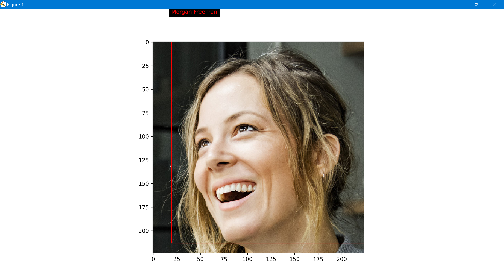

# Entertainment Domain: Face Detection and Recognition

This repository contains a collection of projects related to the entertainment domain, specifically focused on face detection and recognition tasks. The projects aim to enhance the user experience in a movie application, automate cast and crew information, and develop a face identification model for recognizing human faces.

## Project 1: Automated Cast Information in Movie Scenes

  

### Context

Company X owns a movie application that provides movie streaming services to millions of users on a subscription basis. The company aims to automate the process of displaying cast information in each scene when a user pauses a movie. The in-house computer vision and multimedia experts need to detect faces in movie scenes.

### Data Description

The dataset comprises images and corresponding masks of human faces.

### Project Objective

Build a face detection system to accurately identify human faces in movie scenes and display actor details.

#### Steps and Tasks

1. **Data Preparation**
   - Import and read the `images.npy` dataset.
   - Split the data into features (X) and labels (Y), unifying the shape of images.
   - Replace masked area pixels with 1 in X.
   - Split the data into training and testing sets.

2. **Model Building**
   - Design a face mask detection model using MobileNet architecture with appropriate Upsampling layers.
   - Implement a custom Dice Coefficient and Loss function.
   - Train and fine-tune the model.
   - Evaluate the model's performance and share insights.

3. **Test and Visualization**
   - Test the model on a test image and visualize predicted masks on faces.

## Project 2: Image Classifier Dataset Creation

### Context

Company X intends to create an image dataset for building an image classifier. The dataset will be used by the AI team to develop an image classification model. The task involves detecting faces in profile images of individuals.

### Data Description

The dataset comprises profile images of people.

### Project Objective

Create an image dataset for an image classifier that involves face detection and metadata extraction.

#### Steps and Tasks

1. **Data Reading and Detection**
   - Read/import images from the `training_images` folder.
   - Detect faces using the `haarcascade_frontalface_default.xml` from the internet.

2. **Metadata Extraction**
   - Extract metadata of faces from the detected images.
   - Store metadata in a DataFrame.

3. **Data Saving**
   - Save the metadata DataFrame as a CSV file.

## Project 3: Face Identification Model

### Domain: Face Recognition

Company X aims to build a face identification model to recognize human faces.

### Data Description

The dataset contains images and masks of human faces.

### Project Objective

Develop a face identification model using embeddings and SVM classifier for recognizing human faces.

#### Steps and Tasks

1. **Data Loading**
   - Unzip, read, and load the `faces_dataset` dataset.

2. **Metadata Creation**
   - Write a function to create metadata from images.
   - Iterate through images to generate metadata.

3. **Embeddings Generation**
   - Generate embeddings vectors for each face using the `vgg_face_weights.h5` model.

4. **Distance Metrics**
   - Build distance metrics to measure similarity between images.

5. **Dimensionality Reduction**
   - Apply PCA for dimensionality reduction.

6. **SVM Classifier**
   - Build an SVM classifier for mapping images to the right person.

7. **Test and Prediction**
   - Import and display test images.
   - Use the trained SVM model to predict faces in test images.

Feel free to explore each project folder for more detailed information about the steps, code, and implementation.

# How to use this github repo
1. If you have training dataset the dirctly use our code to train the data and generate "Faces_dataset"
2. Once you generate "faces_dataset" you are ready to use all our codes given above
